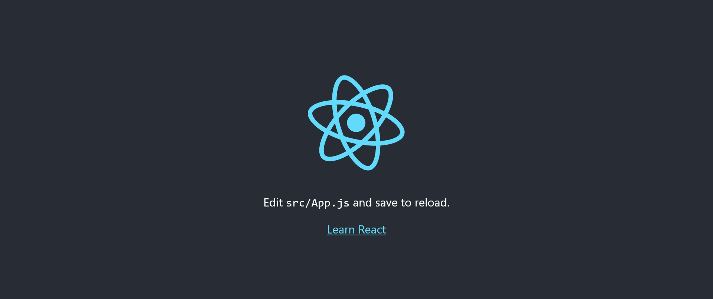

# Basics_of_React

 Introduction to the basics of React

 To work with React, you should have knowledge of HTML, CSS and JavaScript.

 ### Contents
 1. What is React?
 2. Prepare the use of React
 3. Start a React project
 4. "Hello World" in React
 5. JSX (JavaScript XML)

 
 
 
-------------------------------------------------------

## 1. What is React?
React is a JavaScript library developed by Facebook and contains a basic framework for the output of user interface components for websites. The components have a hierarchical structure and can be displayed as a separate HTML tag. React creates a virtual DOM in memory, where all necessary changes can be made instead of changing the DOM of the web browser directly. React is therefore an ideal basis for single-page applications (SPA).

SPAs are web applications that consist of just one HTML document and an associated JavaScript file, the content of which is loaded dynamically. This means that no additional page call for further files is necessary, but the higher-level JavaScript on the client side is used to render the new view. Classic web applications usually consist of several HTML documents that are linked to each other. When the website is changed, communication with the server must be repeated. If there are many requests from visitors, this places a heavy load on the server.

With SPAs, client-side performance is increased and the server is relieved. The reduced client-server communication reduces the waiting time for users enormously. Depending on the application, it can also be navigated offline once the page has been loaded and the data has been cached in the web browser's web storage. SPAs are well suited for web applications with a high number of visitors in order to reduce the load on the server.

An SPA is actually just JavaScript that is managed in folders and files. React offers the necessary tools for this. React places few requirements on the environment to be executed, which is why the library is very flexible and is also often used for individual interactive parts of websites. The use of React is worthwhile if you have a user interface with a lot of interactions in which the state is constantly changing.


## 2. Prepare the use of React
To use React, [Node.js](https://nodejs.org/en/download) and npm must first be installed. As a rule, it should already be installed if you have already worked with JavaScript. Node.js is a JavaScript runtime environment that can execute JavaScript outside the web browser. You can also find a short guide here [GitHub - BellaMrx](https://github.com/BellaMrx/WebDevelopment_Basics#11-use-javascript-on-the-server-side---nodejs).

You can check whether Node.js and npm are already installed in the terminal with :

   ```
    $ node --version
    $ npm --version
   ```
When a version is displayed, you can start using React. Alternatively, the online editor [CodeSandbox](https://codesandbox.io) can also be used to learn and test React.


## 3. Start a React project
To create a React application, I use **create-react-app**. This allows a React project to be set up with a command in the terminal (prerequisite: Node.js and npm). 

This allows **create-react-app** to be installed via the terminal:

   ```
    $ npm install -g create-react-app
   ```

As soon as **create-react-app** has been installed, a new project can be created in future with the following command:

   ```
    $ npx create-react-app my-project
   ```

 

 

 


Any name can be used for "my-project". When using it for the first time, packages may still be installed. After the new React project has been created, a "my-project" folder is created with the following folder structure:

 

| Folder            | Description |
| ----------------- | ----------- |
| node_modules      | The folder contains the necessary Node.js packages. |
| public            | The folder contains the index.html start page. This page is displayed together with the JavaScript in the src/ directory. |
| src               | This folder initially contains everything that is required for React. The most important file for further learning of React is app.js, which implements the React components. |
| .gitignore        | The files and directories that are not to be checked into the Git repository are listed here. |
| package.json      | This contains the configuration of the React application, such as start scripts and the installed dependencies.
| Readme.md         | This contains the description of the various start scripts and a link to the online documentation |
| package-lock.json | Data is important for npm and describes which packages are required with which version.  |

To run the application with **create-react-app**, change to the directory in the terminal with `cd`:

   ```
    $ cd my-project
   ```

Now the React application can be run with :

   ```
    $ npm start
   ```

A new browser window should now open with the generated React application. If not, open the browser and enter **localhost:3000** in the address bar.

In addition to `npm start`, there is also `npm test` for running tests and `npm run build`, which creates the application for operation in a **build** folder.

In VS Code: install **React Native Tools** via the extensions. And then:

   ```
    $ npx create-react-app my-project
   ```
   ```
    $ cd my-project
   ```
   ```
    $ npm start
   ```

 

 

 

Now a web page should open automatically even with VS code:

 

Before starting with VS code, it is best to change the file format so that the code is not mutilated. Simply click on it and enter a different format:

 


## 4. "Hello World" in React
If you now change to the *my-project/src/* directory and open the *app.js* file there, you will find the following code:

   ```
   import logo from './logo.svg';
   import './App.css';

   function App() {
      return (
         <div className="App">
            <header className="App-header">
               
               <p>
                Edit <code>src/App.js</code> and save to reload.
               </p>
               <a
                className="App-link"
                href="https://reactjs.org"
                target="_blank"
                rel="noopener noreferrer"
               >
                Learn React
               </a>
            </header>
         </div>
      );
   }

   export default App;   
   ```

If you change this code as follows:

 [Complete Code](https://github.com/BellaMrx/Basics_of_React/tree/main/Examples/Part_1) --> **Examples/Part_1/...** 

   ```
   import React from 'react';

   function App() {
      return ( 
         <div>
            <h1> Hello World in React </h1> 
            <p> A simple React application in execution. </p>  
         </div >
      );
   }

   export default App;
   ```

If the React application is now opened in the browser with localhost:3000 (if the browser is still open, it loads automatically), the browser displays this:

 

The example is very simple, but it shows that *App.js* is just a JavaScript function without parameters and returns an "HTML" (only similar) code. The JavaScript function is also called a *function component*, and the "HTML" code is called *JSX (JavaScript XML)*.

If the React application is to be uploaded and run on a web host, it must first be built with `npm run built`. The files created in the *build* folder can then be uploaded to the web host and used.

#### Note
The index.html file created in the *build* folder cannot be opened by double-clicking because the webpacks are set up so that the static files are loaded from the root directory and not from the *build* directory. However, this can be remedied by adding the following to the *package.json* file:

  ```
   "homepage": ".",
  ```
like this:

  ```
   {  
      "name": "my-project",
      "version": "0.1.0",
      "homepage": ".",
      "private": true,
      "dependencies": {
      "@testing-library/jest-dom": "^5.17.0",
      ...
   },
   ...
  ```

## 5. JSX (JavaScript XML)