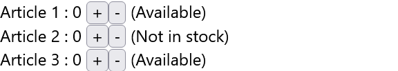

# Basics_of_React

 Introduction to the basics of React

 To work with React, you should have knowledge of HTML, CSS and JavaScript.

 ### Contents
 1. What is React?
 2. Prepare the use of React
 3. Start a React project
 4. "Hello World" in React
 5. JSX (JavaScript XML)
    - 5.1. Use JSX for the UI
    - 5.2. JSX with HTML attributes
    - 5.3. Case distinction
    - 5.4. Lists with React
 6. Render elements
 7. React components and props
    - 7.1. Functional components
    - 7.2. Class components
    - 7.3. Props
 8. State management in React
   - 8.1. Changing the `state` object
   - 8.2. Children props
 9. Events and their handlers
   - 9.1. Pass arguments to event handler
 10. Life cycle of components
   - 10.1. Mounting

 
-------------------------------------------------------

## 1. What is React?
React is a JavaScript library developed by Facebook and contains a basic framework for the output of user interface components for websites. The components have a hierarchical structure and can be displayed as a separate HTML tag. React creates a virtual DOM in memory, where all necessary changes can be made instead of changing the DOM of the web browser directly. React is therefore an ideal basis for single-page applications (SPA).

SPAs are web applications that consist of just one HTML document and an associated JavaScript file, the content of which is loaded dynamically. This means that no additional page call for further files is necessary, but the higher-level JavaScript on the client side is used to render the new view. Classic web applications usually consist of several HTML documents that are linked to each other. When the website is changed, communication with the server must be repeated. If there are many requests from visitors, this places a heavy load on the server.

With SPAs, client-side performance is increased and the server is relieved. The reduced client-server communication reduces the waiting time for users enormously. Depending on the application, it can also be navigated offline once the page has been loaded and the data has been cached in the web browser's web storage. SPAs are well suited for web applications with a high number of visitors in order to reduce the load on the server.

An SPA is actually just JavaScript that is managed in folders and files. React offers the necessary tools for this. React places few requirements on the environment to be executed, which is why the library is very flexible and is also often used for individual interactive parts of websites. The use of React is worthwhile if you have a user interface with a lot of interactions in which the state is constantly changing.


## 2. Prepare the use of React
To use React, [Node.js](https://nodejs.org/en/download) and npm must first be installed. As a rule, it should already be installed if you have already worked with JavaScript. Node.js is a JavaScript runtime environment that can execute JavaScript outside the web browser. You can also find a short guide here [GitHub - BellaMrx](https://github.com/BellaMrx/WebDevelopment_Basics#11-use-javascript-on-the-server-side---nodejs).

You can check whether Node.js and npm are already installed in the terminal with :

   ```
    $ node --version
    $ npm --version
   ```
When a version is displayed, you can start using React. Alternatively, the online editor [CodeSandbox](https://codesandbox.io) can also be used to learn and test React.


## 3. Start a React project
To create a React application, I use **create-react-app**. This allows a React project to be set up with a command in the terminal (prerequisite: Node.js and npm). 

This allows **create-react-app** to be installed via the terminal:

   ```
    $ npm install -g create-react-app
   ```

As soon as **create-react-app** has been installed, a new project can be created in future with the following command:

   ```
    $ npx create-react-app my-project
   ```

 

 

 


Any name can be used for "my-project". When using it for the first time, packages may still be installed. After the new React project has been created, a "my-project" folder is created with the following folder structure:

 

| Folder            | Description |
| ----------------- | ----------- |
| node_modules      | The folder contains the necessary Node.js packages. |
| public            | The folder contains the index.html start page. This page is displayed together with the JavaScript in the src/ directory. |
| src               | This folder initially contains everything that is required for React. The most important file for further learning of React is app.js, which implements the React components. |
| .gitignore        | The files and directories that are not to be checked into the Git repository are listed here. |
| package.json      | This contains the configuration of the React application, such as start scripts and the installed dependencies.
| Readme.md         | This contains the description of the various start scripts and a link to the online documentation |
| package-lock.json | Data is important for npm and describes which packages are required with which version.  |

To run the application with **create-react-app**, change to the directory in the terminal with `cd`:

   ```
    $ cd my-project
   ```

Now the React application can be run with :

   ```
    $ npm start
   ```

A new browser window should now open with the generated React application. If not, open the browser and enter **localhost:3000** in the address bar.

In addition to `npm start`, there is also `npm test` for running tests and `npm run build`, which creates the application for operation in a **build** folder.

In VS Code: install **React Native Tools** via the extensions. And then:

   ```
    $ npx create-react-app my-project
   ```
   ```
    $ cd my-project
   ```
   ```
    $ npm start
   ```

 

 

 

Now a web page should open automatically even with VS code:

 

Before starting with VS code, it is best to change the file format so that the code is not mutilated. Simply click on it and enter a different format:

 


## 4. "Hello World" in React
If you now change to the *my-project/src/* directory and open the *App.js* file there, you will find the following code:

   ```
   import logo from './logo.svg';
   import './App.css';

   function App() {
      return (
         <div className="App">
            <header className="App-header">
               
               <p>
                Edit <code>src/App.js</code> and save to reload.
               </p>
               <a
                className="App-link"
                href="https://reactjs.org"
                target="_blank"
                rel="noopener noreferrer"
               >
                Learn React
               </a>
            </header>
         </div>
      );
   }

   export default App;   
   ```

If you change this code as follows:

 [Complete Code](https://github.com/BellaMrx/Basics_of_React/tree/main/Examples/Part_1) --> **Examples/Part_1/...** 

   ```
   import React from 'react';

   function App() {
      return ( 
         <div>
            <h1> Hello World in React </h1> 
            <p> A simple React application in execution. </p>  
         </div >
      );
   }

   export default App;
   ```

If the React application is now opened in the browser with localhost:3000 (if the browser is still open, it loads automatically), the browser displays this:

 

The example is very simple, but it shows that *App.js* is just a JavaScript function without parameters and returns an "HTML" code. The JavaScript function is also called a *function component*, and the "HTML" code is called *JSX (JavaScript XML)*.

If the React application is to be uploaded and run on a web host, it must first be built with `npm run built`. The files created in the *build* folder can then be uploaded to the web host and used.

#### Note
The index.html file created in the *build* folder cannot be opened by double-clicking because the webpacks are set up so that the static files are loaded from the root directory and not from the *build* directory. However, this can be remedied by adding the following to the *package.json* file:

  ```
   "homepage": ".",
  ```
like this:

  ```
   {  
      "name": "my-project",
      "version": "0.1.0",
      "homepage": ".",
      "private": true,
      "dependencies": {
      "@testing-library/jest-dom": "^5.17.0",
      ...
   },
   ...
  ```


## 5. JSX (JavaScript XML)
The syntax of JSX is very similar to that of HTML. With JSX, the HTML is practically written in React, it is actually a mixture of HTML and JavaScript components. JSX also supports CSS. With JSX, HTML elements can be written in JavaScript and attached to the DOM without the usual `createElement()` or `appendChild()` functions. With JSX, the HTML tags are not converted into React elements. JSX does not have to be used, but it makes it easier to write React applications when it comes to what the *user interface* (UI) should look like.


### 5.1. Use JSX for the UI
Here is a simple example of how flexibly JSX can be used:

 [Complete Code](https://github.com/BellaMrx/Basics_of_React/tree/main/Examples/Part_2) --> **Examples/Part_2/...** 

  ```
   import React from 'react';

   const greetings = 'Hello world';
   const title = 'React';
   const ptext = <p> React application during execution. </p>;
   const expression = <p> 420 * 7 = { 420 * 7 } </p>;
   const mlist = ( < ol >
      <li> Item 1 </li>  
      <li> Item 2 </li>
      <li> Item 3 </li>  
    </ol > );

   function App() {
      return ( 
         <div >
            <h1> { greetings } in { title } </h1> 
            { ptext } { expression }
            Enumeration list: { mlist } 
         </div >
      );
   }
   export default App;
  ```

 

Expressions are written in curly brackets `{}` in JSX. These can be simple variables (`greetings`, `title`), properties, mathematical calculations (`expression`), longer HTML blocks between brackets `()` (`mlist`) and any other valid JavaScript expression. However, no JavaScript statements are allowed between the curly braces. JSX acts like a template language, but the full functionality of JavaScript can be used with it.

JSX is automatically transpiled to JavaScript. Learning JSX is relatively easy if you accept it as HTML within the JavaScript code. An alternative to JSX would be TSX (TypeScript). JSX was developed specifically for React and later integrated into other libraries.

The compiler turns JSX into JavaScript code, e.g. from one line:

  ```
   const paragraph = <p>A simple text.</p>;
  ```

From this, a compiler can create the following JavaScript code:

  ```
   let paragraph = React.createElement (
      "p",
      null,
      "A simple text."
   );
  ```

Instead of `Document.createElement`, `React.createElement` was used here, i.e. a React element or an immutable JavaScript object or virtual DOM object is returned. This virtual DOM object is first converted into an output format, such as a DOM element, when a component is rendered. In React, a distinction is made between a virtual and native DOM. This ensures that only what actually changes in the native DOM is changed and that the entire native DOM is not re-rendered, thus limiting the manipulation of the native DOM to a minimum.

Another example: 

 [Complete Code](https://github.com/BellaMrx/Basics_of_React/tree/main/Examples/Part_3) --> **Examples/Part_3/...** 

  ```
   import React from 'react';

   function format_header_1(text, user) {
      return text + ', ' + user.fname + ' ' + user.lname;
   }

   const user = {
      fname: 'Bella',
      lname: 'Mrx'
   };

   function App() {
      return ( 
         <div> 
            <h1> { format_header_1('Welcome', user) } </h1>
         </div>
      );
   }
   export default App;
  ```

 

With the line `<h1> { format_header_1('Welcome', user) } </h1>`, a JavaScript expression was built into JSX with the curly brackets. The function `format_header_1` with two parameters, a string and a JavaScript object `user`, is used here to assemble and return this content.


### 5.2. JSX with HTML attributes
HTML attributes can also be enclosed in curly brackets:

  ```
   const primaryColor = "#008000";
   const parapraph = <p style = {{color: primaryColor}}> Welcome to React </p>
  ```

Here, a JavaScript expression has been integrated into an HTML attribute. In JSX, the camel case notation is used, so instead of *tabindex*, as is usual in HTML, *tabIndex* must be used. The attributes `for` and `class` must not be used because these are also keywords in JavaScript. Instead, `htmlFor` and `className` must be used. 

Stand-alone HTML tags must be closed with `/` (`<.../>`), as JSX follows the XML rules:

  ```
   const userInput = < input type = "text" />;
  ```

If stand-alone HTML tags are not closed correctly or if `for` is used instead of `htmlFor` out of habit, React issues an error message.

#### Comments in JSX
Comments can be noted between the curly brackets in a JavaScript expression:

  ```
   const parapraph = <p> Welcome {/*comment name*/} </p>
  ```

or within a JSX element, the comments can be noted without curly brackets:

  ```
   const parapraph = <p /*comment set color */> Welcome </p>
  ```

or comments can be noted as in JavaScript, but only at the end of the line:

  ```
   const parapraph = <p //comment set color > Welcome </p>
  ```


### 5.3. Case distinction
`if-else` cannot be used within JSX. The tenary operator `?:` (`{i === 1?`true`:`false`}`) can be used for this purpose. A case distinction can be useful if an attribute or element is to be set depending on the condition.

Example: [Complete Code](https://github.com/BellaMrx/Basics_of_React/tree/main/Examples/Part_4) --> **Examples/Part_4/...** 

  ```
   import React from 'react';

   const header_1 = true;

   function isHeader() {
      return header_1;
   }
   const msg = "Welcome to React";

   function App() {
      return ( 
         <div > 
         { isHeader() ? <h1> { msg } </h1> : <p>{msg}</p> } 
         </div>
      );
   }
   export default App;
  ```

Whether the text of the variable `msg` is displayed as `h1` heading or as `p` paragraph text depends on whether the function `isHeader()` returns `true` or `false`. This works not only for HTML elements, but also for attributes:

  ```
   const mark = true;

   function isImportant() {
      return mark;
   }

   const msg = <p style = {{ color: isImportant() ? "green" : "black" }} >
      Welcome to React </p>; 
  ```

 


### 5.4. Lists with React
The JavaScript method `map`, which is defined for arrays, is usually used to process lists. 

An example with `map` in pure JavaScript code:

  ```
   const values = [2, 4, 42, 7, 420];

   const total = values.map(function(value) {
      return value * value;
   });

   console.log(total);     //Output: [ 4, 16, 1764, 49, 176400 ]
  ```

Here, the individual values of `values` are run through using `map()`, each placed in `value` and then multiplied.

A complete example with a list and JSX: 

 [Complete Code](https://github.com/BellaMrx/Basics_of_React/tree/main/Examples/Part_5) --> **Examples/Part_5/...** 

  ```
   import React from 'react';

   const recommendEbooks = [{
         title: 'JavaScript - DOM - Document-Object-Model',
         url: 'https://github.com/BellaMrx/DOM_Document-Object-Model',
         author: 'Bella Mrx',
         id: 3,
      }
      ...
   ];

   function App() {
      return ( 
         <div>
            <h1> Further literature about JavaScript </h1> 
            <ul> {
               recommendEbooks.map(function(book) {
                  return <li key = { book.id } > <a href = { book.url } >
                  { book.title } < /a> (by {book.author}) </li> ;
               })}
            </ul>
         </div>
      );
   }
   export default App;
  ```

To display all `title` in the `recommendEbooks` list with JSX, proceed as follows:

  ```
   recommendEbooks.map(function(book) {
      return <div > { book.title } < /div>;
   })}
  ```

The other data such as `url` and `author` can also be accessed in the same way. The list element `id` has been added as a key attribute for React. This allows React to identify the individual list elements. This identification is required so that React can establish a connection between two instances in the virtual DOM: 

  ```
   recommendEbooks.map(function(book) {
      return <div key = { book.id } > { book.title } < /div>;
   })}  
  ```

The key attribute `key` is used to assign a value in the list that is unique. This value should not be derived from the index of the element in the array.

 


## 6. Render elements
In the previous examples, you did not have to worry about this, this was due to the command `npx create-react-app my-project` ([Chapter 3](https://github.com/BellaMrx/Basics_of_React#3-start-a-react-project)). The React command for rendering HTML on a web page is `ReactDOM.render()`. 

Here is a shortened version of *my-project/src/index.js*:

  ```
   import React from 'react';
   import ReactDOM from 'react-dom';   // for ReactDOM.render()

   import App from './App';


   ReactDOM.render (
      <App />
      document.getElementById('root')
   ); 
  ```

The function `ReactDOM.render()` expects two arguments. The first element is the JSX element to be rendered, which is the instance of the app `<App />`, which is the `function App()` of *my-project/src/App.js*. However, it is also possible to pass this without an instance:

  ```
   ReactDOM.render (
      <p> A simple text </p>
      document.getElementById('root')
   ); 
  ```

The second argument is used to specify where the JSX element to be rendered is to be inserted. In this example, it is an element with `id = root"`, which is located in the HTML file *my-project/public/index.html*.

  ```
   <!DOCTYPE html>
   <html lang="en">
      <head>
         <title>React App</title>
      </head>
      <body>
         <div id="root"></div>
      </body>
   </html>
  ```

In most cases, `ReactDOM.render()` is only used once when the page is called up; another `render()` call is not necessary, as further rendering is then usually carried out by the components.


## 7. React components and props
The most important concept of React is components. A component is an independent and reusable code. Components have the same purpose as JavaScript functions, except that they can be used anywhere in JSX, similar to HTML elements. There are two types of components in React: function components and class components.

Such components are simple parts of the UI (user interface). When an application is developed in React, several such components are usually developed independently of each other and then combined to form a complex UI. A React application has at least one component, which is called the root component.

So far, only the `App()` component in *App.js* has been used here, which was rendered in *index.js* as follows:

  ```
   ReactDOM.render (
      <React.StrictMode>
         <App />
      </React.StrictMode>,
      document.getElementById('root')
   );
  ```

Everything has been done in this app component here, but a React application usually has higher requirements in practice, which increases the amount of code. To keep things clear, the main component is usually divided into several sub-components. For this purpose, *props* (properties) are often used. Such props are similar to function arguments in JavaScript and are often given to the components as external properties.

Here in the example the `<React.StrictMode>` mode was used, this is very helpful and ensures that errors, warnings of page effects or outdated React constructs (deprecated) are displayed on the console or web browser. It is recommended to always use this mode by wrapping the application with it. If the application is built with `npm run build`, the code is removed to keep the code lightweight.


### 7.1. Functional components
A simple functional component:

 [Complete Code](https://github.com/BellaMrx/Basics_of_React/tree/main/Examples/Part_6) --> **Examples/Part_6/...** 

  ```
   import React from 'react';

   function App() {
     return ( 
      <div>
         <h1> Login </h1> 
         <InputT name = "Firstname" / >
         <InputT name = "Lastname" / >
         <InputT name = "E-Mail" / >
      </div>
     );
   }

   function InputT(props) {
     return ( 
      <div> 
         <label> { props.name } </label> : 
         <input type = "text" placeholder = { props.name } />
      </div>
     );
   }
   export default App;
  ```

 

A simple function component `InputT(props)` was created here, which can be used like an HTML element with `<InputT name="Firstname">`. When React recognizes a custom component, all JSX attributes are passed as a single object, here "props", the name for which can be chosen by the user (called "props" for demonstration purposes only).
When the React application is executed, the `InputT` component is rendered three times within the app component, which shows how components refer to other components in the output and can therefore be reused at any time.
Custom components such as `<InputT />` or `<Comment />` must start with a capital letter, in React components with lower case letters such as `<div>` are HTML elements of the DOM.

In the app component, everything was packed between `<div>` and `</div>`, if this is not the case, React throws an error message. There is a rule that the HTML code for JSX fragments must be packed into a top-level element:

  ```
   function InputT(props) {
     return ( 
      <div> 
         <label> { props.name } </label> : 
         <input type = "text" placeholder = { props.name } />
      </div>
     );
   }
  ```

The list example from [Part_5](https://github.com/BellaMrx/Basics_of_React/tree/main/Examples/Part_5) could then look like this as a function component:

 [Complete Code](https://github.com/BellaMrx/Basics_of_React/tree/main/Examples/Part_7) --> **Examples/Part_7/...** 

  ```
   import React from 'react';

   const recommendEbooks = [{
      title: 'JavaScript - DOM - Document-Object-Model',
      url: 'https://github.com/BellaMrx/DOM_Document-Object-Model',
      author: 'Bella Mrx',
      id: 3,
    },
     ...
    ];

   function App() {
     return (
      <div>
         <h1> My guides </h1>
         <ul>
            <Recommendation / >
         </ul>
      </div>
     );
   }

   const Recommendation = () =>
     recommendEbooks.map(book => (
      <li key = { book.id } > < MakeLink link = { book } / >
            by { book.author }) </li > 
   ));

   const MakeLink = props => 
     <a href = { props.link.url } > { props.link.title } </a>

   export default App;
  ```

 

In practice, it is advisable to split a component into further components, e.g. to outsource the setting of the hyperlink `<a>` as a further component. The advantage of this is that a universal component is created that can also be used in other components:

  ```
   ...

   function Recommendation() {
      return recommendEbooks.map(function (book) {
         return ( <li key = { book.id } > < MakeLink link = { book } / >
                  by { book.author }) </li > );
      });
   }


   function MakeLink(props) {
      return (<a href = { props.link.url } > { props.link.title } </a>);
   }

   ...
  ```

This example is the same as in [Part_7](https://github.com/BellaMrx/Basics_of_React/tree/main/Examples/Part_7) only as a function declaration instead of an arrow function declaration. Function components can also be declared with arrow functions, as in JavaScript:

  ```
   function () {...}    // function declaration
   const () => {...}    // arrow function declaration
  ```


### 7.2. Class components
In the early days of React, class components were preferably used to create larger projects. Since the introduction of hooks in React, however, function components have also been used more and more frequently. 

The first example shows the function component `InputT` (from [Part_6](https://github.com/BellaMrx/Basics_of_React/tree/main/Examples/Part_6)) as a class component that is outsourced to a separate file:

To convert a function component into a class component, the following is necessary:
1. the components are extended by the React-`Compoment` class with `extends Component`.
2. an empty `render()` method is created in the component.
3. the content of the component is written inside the `render()` method.
4. if `props` is used, `this.props` is used

 [Complete Code](https://github.com/BellaMrx/Basics_of_React/tree/main/Examples/Part_8) --> **Examples/Part_8/InputT.js...** 

  ```
   import React, { Component } from 'react';

   class InputT extends Component {
      render() {
         return ( 
           <div>
             <label> { this.props.name } </label> :  
             <input type = "text" placeholder = { this.props.name }/> 
           </div>
         );
      }
   }
   export default InputT;
  ```

The `React` and `Component` classes were imported first. `Component` is a base class that is required to create the class component. The `Component` base class is practically extended with the `InputT` class. The class name should begin with a capital letter, it is also advisable to name the file (*InputT.js*) with the class name (`InputT`), as this makes it easier to search for errors during debugging.
Various methods can also be added to the class, but the most important and only method in this example is `render()`. This method renders the JSX code in the browser. With `export default` the class is exported, which extends the base class `Component`. The *InputT.js* file is saved in the *src* directory.

Only the class components of the *InputT.js* file now need to be imported into *App.js*:

 [Complete Code](https://github.com/BellaMrx/Basics_of_React/tree/main/Examples/Part_8) --> **Examples/Part_8/App.js...**

  ```
   import React from 'react';
   import InputT from './InputT';

   function App() {
      return (
         <div>
            <h1> Login </h1>
            <InputT name = "First name" />
            <InputT name = "Last name" />
            <InputT name = "E-Mail" />
         </div>
      );
   }
   export default App;
  ```

 


In React, it has become established to create only one component per file, as this allows you to maintain an overview. When naming the components, the Pascal case notation has become established, i.e. the first letter is always capitalized and if further words are added, this also begins with a capital letter (`InputText`). For the file extension, *.jsx* is often used instead of *.js* to make the use of JSX within the component clear.


### 7.3. Props
Props are arguments that are passed to React components. They are always passed to a component in the same way as an HTML attribute. Props are almost like function arguments in JavaScript and attributes in HTML. 
 
In [Part_7](https://github.com/BellaMrx/Basics_of_React/tree/main/Examples/Part_7) a global variable `recommendEbooks` was used, in practice the possibilities are limited. The more optimal solution would be to use *props*:

[Complete Code](https://github.com/BellaMrx/Basics_of_React/tree/main/Examples/Part_9) --> **Examples/Part_9/...** 

  ```
   import React from 'react';

   const App = () => {
     const recommendEbooks = [{
      title: 'JavaScript - DOM - Document-Object-Model',
      url: 'https://github.com/BellaMrx/DOM_Document-Object-Model',
      author: 'Bella Mrx',
      id: 3,
      },
      ...
      ];
 
      return ( 
         <div>
            <h1> My guides </h1>
            <ul>
               <Recommendation list = { recommendEbooks } / > 
            </ul>
         </div>
      );
   }

   const Recommendation = props =>
     props.list.map(book => ( 
      <li key = { book.id } > < MakeLink link = { book } / >
        by { book.author }) </li> ));

   const MakeLink = props => 
     <a href = { props.link.url } > { props.link.title } </a>

   export default App;
  ```

 

Here *Props* were used to pass the `recommendEbooks` array and the `Recommendation` function component, but the global scope is no longer used. *Props* cannot be changed, they are read-only. If an attempt is made to change the value, an error is thrown.

On the other hand, if a class component is to be created and used with a constructor (constructor()), the props should always be passed as an argument to the constructor and to the React component method `super()`:

  ```
   class Article extends React.Component {
     constructor(props) {
       super(props);
     }
     render() {
       return (
         <div>
           <label>{this.props.name}</label>
           <button>+</button>
           <button>-</button>
             {this.props.instock === "false"
               ? " (Not in stock)"
               : " (Available)"}
         </div>
       );
     }
   }
   ...
  ```

The `constructor()` method is called as the first method when the component is initiated to set up the initial state of the component with the initial values. This is the reason why the `constructor()` method should be called with the props as an argument. `super(props)` initiates the parent's constructor method, thus allowing the component to inherit from the parent ("React.Component`).


## 8. State management in React
React components have a built-in state object that can store properties unique to the component, often referred to as a local state. When the state object changes, the React component is re-rendered. The `state` objects allow interaction, whereas the props are used for the information flow within the component tree. The state is similar to the props, except that the state is private and is controlled exclusively by the (class) component.

This example demonstrates a counter that can be incremented and decremented within a simple class component with the identifier `Article`. Because the local state can only be used with the class component, it is necessary to create a class.

[Complete Code](https://github.com/BellaMrx/Basics_of_React/tree/main/Examples/Part_10) --> **Examples/Part_10/Article.jsx...** 

  ```
   import React from "react";
  
   class Article extends React.Component {
     constructor(props) {
       super(props);
       this.state = {
         counter: 0,
       };
     }
     render() {
       return (
         <div>
           <label>{this.props.name}</label>
           <span> : {this.state.counter} </span>
           <button>+</button>
           <button>-</button>
           <span>
             {this.props.instock === "false"
               ? " (Not in stock)"
               : " (Available)"}
           </span>
         </div>
       );
     }
   }
   export default Article;
  ```

The `state` object (here: `state.this`) is initialized in the constructor. The `state` object only has one property with `counter`, but any number of properties can be used. The *Article.jsx* file is saved in the */src* folder together with the *App.js*, which then looks like this:

 [Complete Code](https://github.com/BellaMrx/Basics_of_React/tree/main/Examples/Part_10) --> **Examples/Part_10/App.js...** 

  ```
   import React from "react";
   import Article from "./Article";

   const App = () => {
       return (
         <div >
           <Article name = "Article 1" instock = "true" / >
           <Article name = "Article 2" instock = "false" / >
           <Article name = "Article 3" instock = "true" / >
         </div>
       );
   };
   export default App;
  ```

 


#### React Hooks as an alternative
The feature with the local state no longer has to be used only with class components. With React Hooks (since version 16.8.), there is an alternative in which state and other React functions can also be used as function components. The trend is moving more towards hooks, but you should still familiarize yourself with the concept of class components so that you can better understand what is behind the hooks later on.

#### Use the `state` object in the class component
In the *Article.jsx* example, a `state` object was used in the component with `this.state.propertyname`:

  ```
   ...
   <label>{this.props.name}</label>
   <span> : {this.state.counter} </span>
   <button>+</button>
   ...
  ```

As with the props, access is via `this` and then the `state` object, followed by the identifier of the `counter` property. For all new `Article` class components, the initial addition of `counter` has been set to 0.


### 8.1. Changing the `state` object
The only place where the individual properties of `this.state` can be set is in the constructor. To subsequently change the value of the `state` object, the `this.setState()` method must be used. If the value in a `state` object changes, the component is rendered according to the new value:

 [Complete Code](https://github.com/BellaMrx/Basics_of_React/tree/main/Examples/Part_11) --> **Examples/Part_11/Article.jsx...** 

  ```
   ...

   class Article extends React.Component {
     constructor(props) {
       super(props);
       this.state = {
         counter: 0,
         stock: this.props.instock,
       };
     }

     incrementCounter = () => {
       if (this.state.stock === "true" && this.state.counter < 9)
         this.setState({ counter: this.state.counter + 1 });
       if (this.state.counter >= 9)
         this.setState({ stock: (this.state.stock = "false") });
     };

     decrementCounter = () => {
       if (this.state.counter && this.state.counter <= 9) {
         this.setState({ counter: this.state.counter - 1 });
         this.setState({ stock: (this.state.stock = "true") });
       }
     };

     render() {
       return (
         <div>
           {this.props.children}
           <label>{this.props.name}</label>
           <span> : {this.state.counter} </span>
           <button onClick={this.incrementCounter}>+</button>
           <button onClick={this.decrementCounter}>-</button>
           <span>
             {this.state.stock === "false" 
                ? " (Not in stock)" : " (Available)"}
           </span>
         </div>
       );
     }
   }
   ...
  ```

Here, a handler for `onClick` has been set up within `<button>`, which is triggered when the button is clicked. For the plus button, `this.incrementCounter()` is called and for the minus button, `this.decrementCounter` is called. According to the callback method, the value for `counter` is then increased or decreased by 1 via `this.setState()`.
The value of the `instock` prop was passed to the `state` object `stock`, as the props are read-only and cannot be changed. The status of `this.state.stock` is used to output whether items are still in stock or not.

  ```
   ...
     incrementCounter = () => {
       if (this.state.stock === "true" && this.state.counter < 9)
         this.setState({ counter: this.state.counter + 1 });
       if (this.state.counter >= 9)
         this.setState({ stock: (this.state.stock = "false") });
     };
   ...
  ```

Here, an `if` query as to whether `this.state.stock` is `true` is combined with the logical AND operator `&&` to determine whether the value of `this.state.counter` increases by 1. If this is no longer the case, the status of `this.state.stock` is set to `false` with `this.setState` and the state of the component is re-rendered.

  ```
   ...
      <span>
         {this.state.stock === "false" 
         ? " (Not in stock)" : " (Available)"}
      </span>
   ...
  ```

Here the output `"(Available)"` becomes `"(Not in stock)"`. For each component, a maximum of 9 elements of an item are in stock. If the value of `counter` equals 9, the value of `this.state.stock` is set to `false`, which means that no further incrementation is possible. The example can also be extended by simply adding another property to the `state` object from the static value of 9 items in order to allow a maximum number of items individually for each item.

With `this.decrementCounter()` something similar happens, where it is checked whether the value of `counter` is not equal to 0 and less than or equal to 9. Only if the operation is true, `counter` is reduced by 1 with `this.setState()` and the property of `this.state.stock` becomes `true`:

  ```
   ...
     decrementCounter = () => {
       if (this.state.counter && this.state.counter <= 9) {
         this.setState({ counter: this.state.counter - 1 });
         this.setState({ stock: (this.state.stock = "true") });
       }
     };
   ...
  ```

If the property of a `state` object is to be changed by a component, the `setState()` method should always be used to ensure that the component is refreshed and rendered.


### 8.2. Children props
This example shows how child or sub-props can be transferred to the components and used:

 [Complete Code](https://github.com/BellaMrx/Basics_of_React/tree/main/Examples/Part_11) --> **Examples/Part_11/App.js...** 

  ```
   ...
      <Article name = "Article 1" instock = "true" >
        <h2> Article 1 </h2>
      </Article>
      <Article name = "Article 2" instock = "false" >
        <h2> Article 2 </h2>
      </Article>
      <Article name = "Article 3" instock = "true" >
        <h2> Article 3 </h2>
      </Article>
   ...
  ```

To access the `h2` elements in the class components here, you can use the prop provided for this with `this.props.children`:

 [Complete Code](https://github.com/BellaMrx/Basics_of_React/tree/main/Examples/Part_11) --> **Examples/Part_11/Article.jsx...** 

  ```
   ...
   class Article extends React.Component {
     constructor(props) {
       super(props);
       this.state = {
         ...
       };
     }

   ...

     render() {
       return (
         <div>
           {this.props.children}
           <label>{this.props.name}</label>
           ...
         </div>
       );
     }
   }
   ...
  ```

 


## 9. Events and their handlers
React has the same events such as `click`, `change`, `mouseover` etc. that we already know from HTML. To be able to use these events, the camel case notation must be used. In React, `onclick` becomes `onClick` and the event handler must be placed in curly brackets `{}`:

usual notation:
  ```
   onclick = "handleEvent()"
  ```

in React with JSX:
  ```
   onClick = {handleEvent}
  ```

A simple example, with a message box that is displayed as soon as the button is clicked:

 [Complete Code](https://github.com/BellaMrx/Basics_of_React/tree/main/Examples/Part_12) --> **Examples/Part_12...** 

  ```
   import React, { Component } from "react";

   class App extends Component {
       eventButton = () => {
           alert("Button has been pressed! -> " + this);
       };
       render() {
           return ( 
             <div>
               <h1> Trigger events in React </h1> 
               <button onClick = { this.eventButton } >
               Trigger event
               </button>
             </div>
           );
       }
   }
   export default App;
  ```

 

The special feature of `this` must be pointed out here. It is not typical for React, but for JavaScript, but this can be confusing for beginners: When passing in JSX, the event method must be bound to the class with `this` (here: `this.eventButton`). In JavaSript, class methods are not bound by default. This binding can be done with the `bind()` method within the constructor or, as in the example, using the arrow function. If `eventButton = () =>` is changed to `eventButton()`, the output of `this` in the message box will be `undefined`.


### 9.1. Pass arguments to event handler
If parameters are to be passed to the event handler, the `bind()` method or an (anonymous) arrow function can also be used:

 [Complete Code](https://github.com/BellaMrx/Basics_of_React/tree/main/Examples/Part_13) --> **Examples/Part_13/App.js...** 

  ```
   import React, { Component } from "react";

   class App extends Component {
     eventButton = (args) => {
       alert(args + " : " + this);
     };
     render() {
       return ( 
         <div>
           <h1> Trigger events in React </h1>
           <button onClick = {
               () => this.eventButton("One argument") 
             } > Trigger event </button>
         </div>
       );
     }
   }

   export default App;
  ```

 

When the button is pressed, a simple string is passed to the event handler and output in a message box.


## 10. Life cycle of components
This topic is very helpful and important to better understand React. There are three sections to a component:

 - Mounting: This is where the component is created and integrated into the application, making it visible, i.e. the element is practically inserted into the DOM.
 - Updating: This cycle describes the time during which the component is visible and can be interacted with by the user. An update is carried out when the component is adapted, from the outside to the props and from the inside to the state.
 - Unmounting: The last cycle is triggered when the component is removed from the DOM.

In each of these lifecycles, different built-in methods are available that can be implemented and executed as soon as the component is in the corresponding cycle. These methods are also referred to as *lifecycle hooks*.

The next example shows a music playlist from which individual elements can be removed. For this example, a music database was created/simulated here *songList.js*, which contains an array of the individual song titles with ID, the title, the interpreter and the genre. The only function included here is `getPlaylist()`, which returns the complete array with the playlist:

 [Complete Code](https://github.com/BellaMrx/Basics_of_React/tree/main/Examples/Part_14) --> **Examples/Part_14** 

  ```
   const songs = [{
       _id: 1234,
       song: "Stairway To Heaven",
       interpreter: "Led Zeppelin",
       genre: "Rock",
   },
   {
       _id: 1235,
       song: "Blinding Lights",
       interpreter: "The Weeknd",
       genre: "Pop",
   },
    ...
   ];

   export function getPlaylist() {
   return songs;
   }
  ```

##### ! Note - constructor and other lifecycle methods are executed twice
During execution, the index.js file should be adapted later if necessary and the `<React.StrictMode>` removed to ensure that the constructors are "pure". This double execution only affects the development version. In production mode (`npm run build`) the methods are not implemented twice.


### 10.1. Mounting


